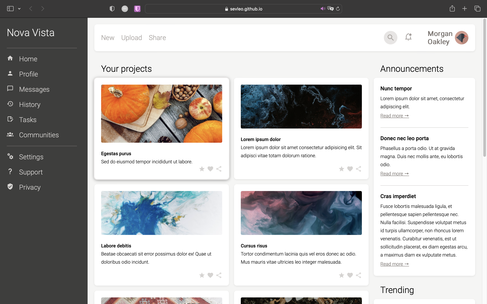

# Admin Dashboard

Employing the dynamic capabilities of CSS Grid and Flexbox, crafting a sleek and adaptable layout reminiscent of a dashboard. This approach ensures a clean, organized, and responsive design, accommodating various screen sizes effortlessly.

## Table of Contents

- [Demo](#demo)
- [Technologies](#technologies)
- [Contributing](#contributing)
- [License](#license)
- [Acknowledgements](#acknowledgements)

## Demo

You can view the project at [Admin Dashboard Demo](https://sevleo.github.io/TOP-Dashboard/).

## Technologies

- CSS
- HTML

## Contributing

Contributions are welcome! If you'd like to contribute to this project, please follow these guidelines:

1.  Fork the repository.
2.  Create a new branch for your feature or bug fix.
3.  Make your changes and commit them.
4.  Push your changes to your fork.
5.  Create a pull request.

## License

This project is licensed under the [MIT LICENSE](./LICENSE)

## Acknowledgements

Eugene Golovesov:
https://unsplash.com/photos/a-wooden-table-topped-with-pumpkins-and-nuts-b7dg9rX9zhI

Alex Shu:
https://unsplash.com/photos/8gNbhF5AGcs

USGS:
https://unsplash.com/photos/hoS3dzgpHzw

Pawel Czerwinski:
https://unsplash.com/photos/Lki74Jj7H-U
https://unsplash.com/photos/6lQDFGOB1iw

Vasilina Sirotina:
https://unsplash.com/photos/a-mirror-sitting-in-the-middle-of-a-forest-0SjQ6KcwS4k
https://unsplash.com/photos/iXRGd_Lj3gA

Anne Laure P:
https://unsplash.com/photos/looking-up-at-tall-bamboo-trees-in-a-forest-wVmz75D5ztk

artawkrn:
https://unsplash.com/photos/two-people-reaching-out-their-hands-to-touch-each-other-tXnsbe-Y0To

MARIOLA GROBELSKA:
https://unsplash.com/photos/8a7ZTFKax_I

Dominik Van Opdenbosch:
https://unsplash.com/photos/lNeIjS1rXus

David Vives:
https://unsplash.com/photos/OaxxuJGqlVU

Oscar Sutton:
https://unsplash.com/photos/yihlaRCCvd4
